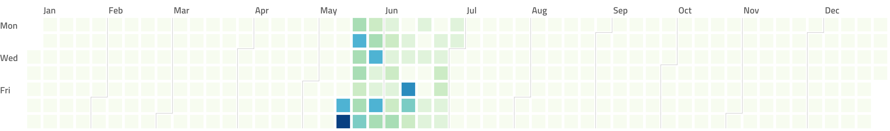
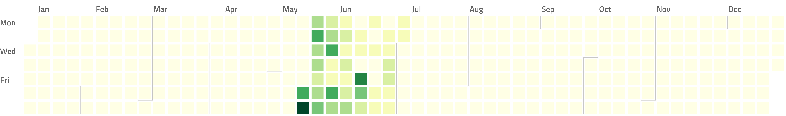
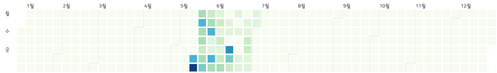
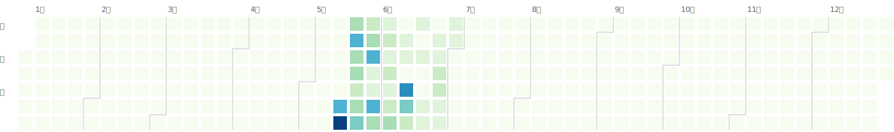
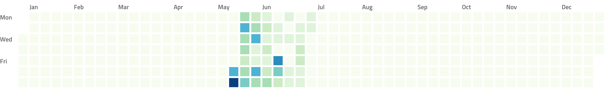
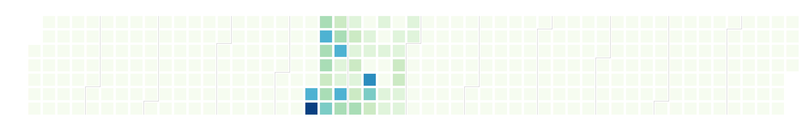
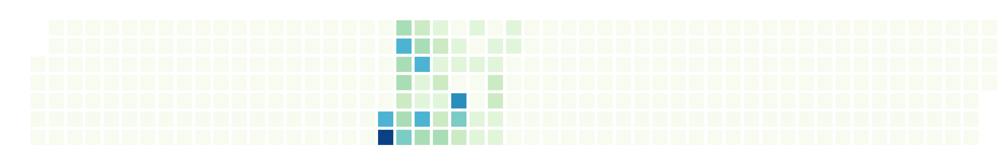

[](https://goreportcard.com/report/github.com/nikolaydubina/calendarheatmap)
[](https://pkg.go.dev/github.com/nikolaydubina/calendarheatmap/charts)
[](https://codecov.io/gh/nikolaydubina/calendarheatmap)
[](https://github.com/nikolaydubina/calendarheatmap/actions)
[](https://github.com/avelino/awesome-go#science-and-data-analysis)
[](https://securityscorecards.dev/viewer/?uri=github.com/nikolaydubina/calendarheatmap)

Self-contained, plain Go implementation of calendar heatmap inspired by GitHub contribution activity available via CLI and [calendarheatmap.io](https://calendarheatmap.io)

```
$ go install github.com/nikolaydubina/calendarheatmap@latest 
$ echo '{
    "2020-05-16": 8,
    "2020-05-17": 13,
    "2020-05-18": 5,
    "2020-05-19": 8,
    "2020-05-20": 5
}' | calendarheatmap > chart.png
```

Basic


Colorscales





UTF-8


SVG



Without month separator


Without labels


Without labels, without separator

