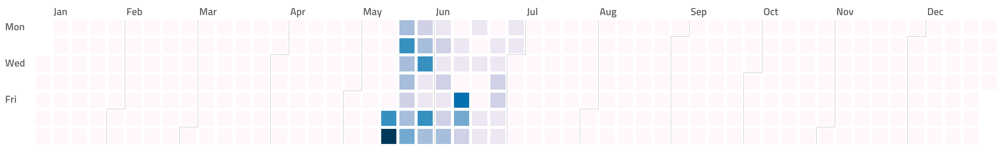
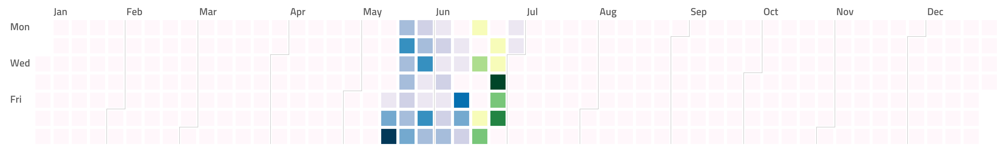
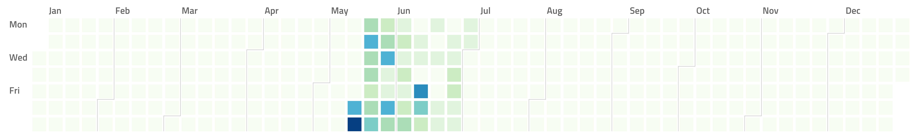
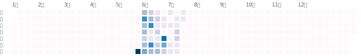

[](https://goreportcard.com/report/github.com/nikolaydubina/calendarheatmap)
[](https://pkg.go.dev/github.com/nikolaydubina/calendarheatmap/charts)
[](https://codecov.io/gh/nikolaydubina/calendarheatmap)
[](https://github.com/sindresorhus/awesome)

Self-contained, plain Go implementation of calendar heatmap inspired by Github contribution activity.

```
$ go build
$ echo '{
    "2020-05-16": 8,
    "2020-05-17": 13,
    "2020-05-18": 5,
    "2020-05-19": 8,
    "2020-05-20": 5
}' | ./calendarheatmap > chart.png
```

- Basic



- Negative values presented via an alternative color scheme



- Colorscales



- UTF-8


- SVG



- Without month separator


- Without labels


- Without labels, without separator


## GitHub stars over time

[](https://starchart.cc/nikolaydubina/calendarheatmap)
