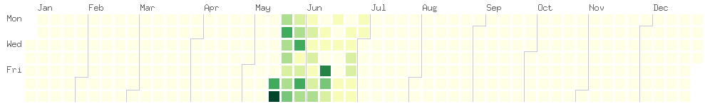

[](https://goreportcard.com/report/github.com/nikolaydubina/calendarheatmap)
[](https://pkg.go.dev/github.com/nikolaydubina/calendarheatmap/charts)
[](https://godoc.org/github.com/nikolaydubina/calendarheatmap/charts)

Self-contained, plain Go implementation of calendar heatmap inspired by Github contribution activity.

Colorscales




Without month separator


Without labels


Without labels, without separator


Example:

```go
countByDayOfYear := map[int]int{
    1: 10,
    22: 15,
    150: 22,
    366: 55,
}

img := charts.NewHeatmap(charts.HeatmapConfig{
    Year:               2020,
    CountByDay:         countByDay,
    ColorScale:         colorscales.PuBu9,
    DrawMonthSeparator: true,
    DrawLabels:         true,
    ...
})
```

You can run it in your Go code or as standalone script. 
Check full example at `examples/main.go` and `input.txt` for more details.
Generate examples above with `./generate_examples.sh`.
