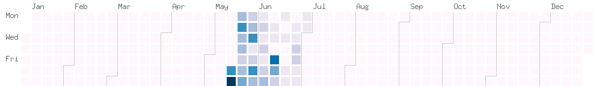
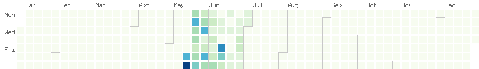

Self-contained plain Go implementatino of calendar heatmap inspired by Github contribution activity.

Colorscales

Without month separator

You can run it in your Go code or as standalone script. 
Check `example/main.go` and `input.txt` for more details.
